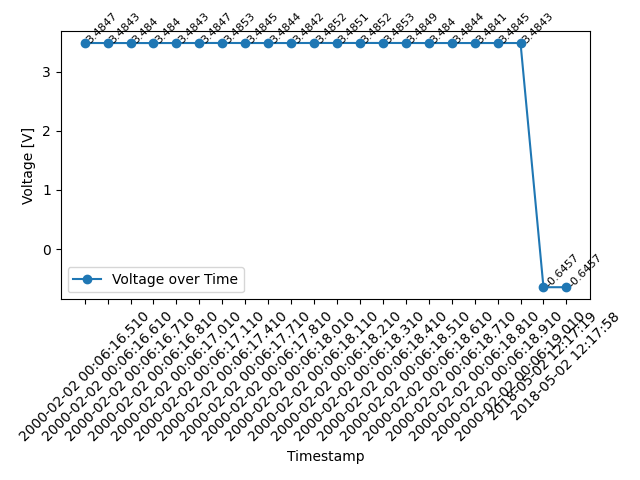

# Tasks assigned:
1. Each file import should be able to be triggered with a single function call.
2. For as many of the test files complete the following.
   * Extract the metadata at the top of the data file. Write the metadata as key value pairs in a txt file to the results directory.
   * Import the data and write it as a csv in the results directory. Feel free to use any python packages to accomplish this task.
3. Plot all voltage traces across all files as a function of time in a single figure. Use any python-based plotter such as matplotlib, plotly, bokeh, etc.
4. Save the figure as a `.png` to the results folder.

# Actions performed:

This project processes data files in various formats, normalizes the data, and generates visualizations. It is divided into three main modules:

1) Input Module (file_tranformation.py): 
Reads and processes the input files, extracting metadata and converting data into CSV format. (Task 1, 2.1)
2) Preprocessing Module (preprocessing_module.py): Cleans and normalizes the data, ensuring consistency and filling in missing values. (Task 2.1)
3) Graph Module (generate_graphs.py): Generates visualizations (graphs) from the processed data and saves the result as a PNG image. (Task 2.3)
4) Main Module (main.py): Integrates the other modules, coordinating the data processing workflow from start to finish.

# Output:

